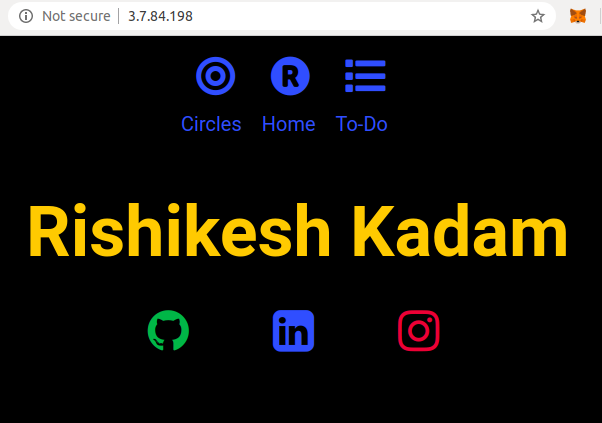
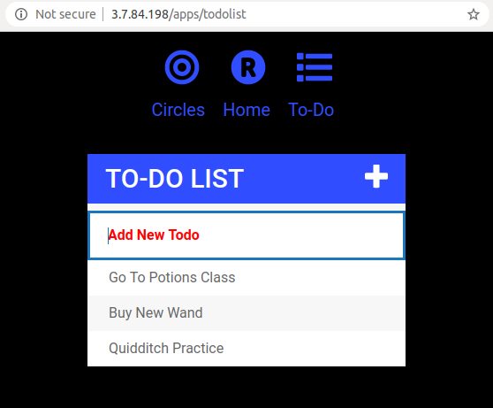
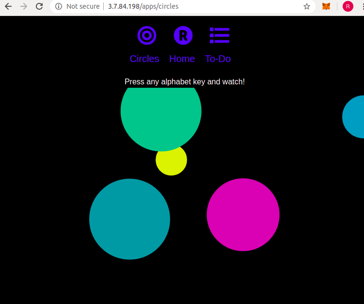

# Simple Website Hosted on AWS Lightsail
Done as an experiment in course 'Cloud Computing'

### Refer to the PDF file for instructions on hosting the project on AWS Lightsail and configuration of proxy server.

## Screenshots

